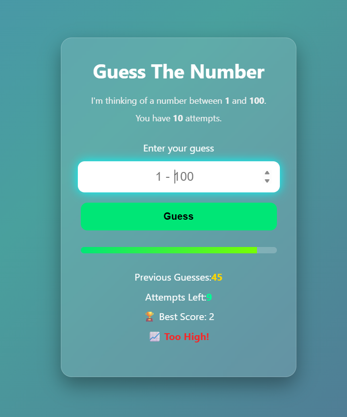
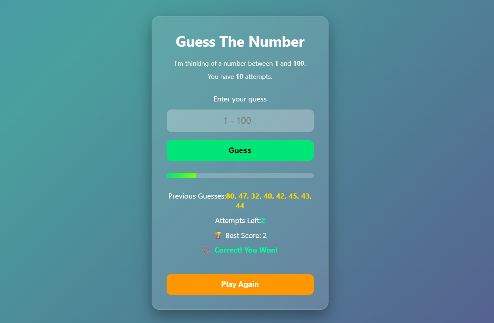

# Guess The Number


Presenting a fun and interactive number guessing game.

The computer randomly selects a number between **1 and 100**, and you have **10 attempts** to guess it correctly. The game provides real-time feedback, tracks your best score using **Local Storage**, and features a modern responsive UI.

## Tech Stack

- HTML5
- CSS3
- JavaScript (ES6)

## Features

- Random number generation
- High / Low hints after every guess
- Previous guesses tracker
- Attempts counter with progress bar
- Best Score saved using Local Storage
- Modern glassmorphism UI with animated background
- Play Again functionality

<h2 align="center">Snaps from the Game</h2>

<p align="center">
  
</p>

<p align="center">
  
</p>

## Live Demo

> https://guess-the-number-pp.vercel.app/

## Project Structure

```
guess-the-number/
│
├── assets/
│   ├── game-start.png
│   └── winning-screen.png
│
├── index.html
├── style.css
├── script.js
└── README.md

```

## Connect with Me

- LinkedIn: https://www.linkedin.com/in/prince-pathak-142651373
- GitHub: https://github.com/princepathak25

---

### Author 
Prince Pathak
